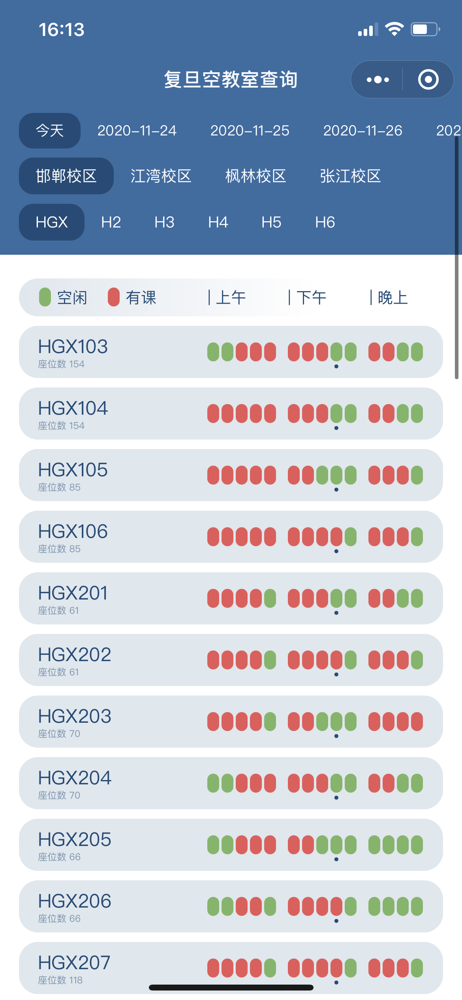
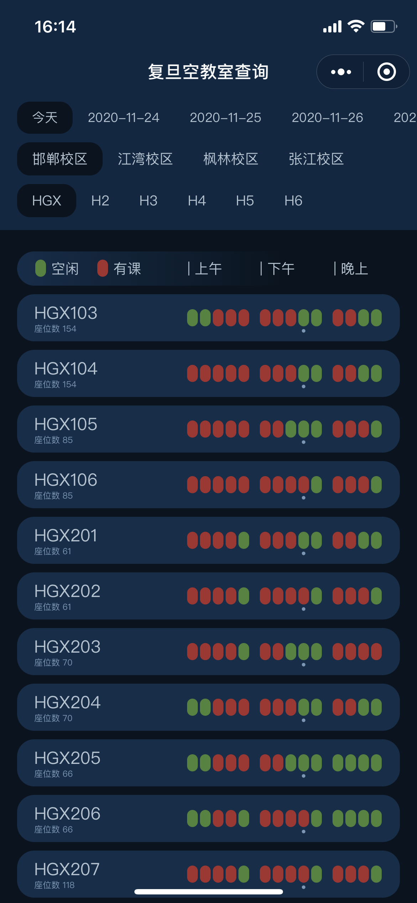

# FDU Classrooms 复旦空教室（微信小程序）

使用[小程序开发框架](https://developers.weixin.qq.com/miniprogram/dev/framework/)开发的复旦空闲教室查询系统。

- 使用 Python 抓取校园相关网站提供的空教室数据并整合，实现快捷便利的校内空闲教室查询功能
- 自行设计 UI，并使用小程序框架进行 CSS 实现；适配了“深色模式”等移动端新特性

小程序截图：

